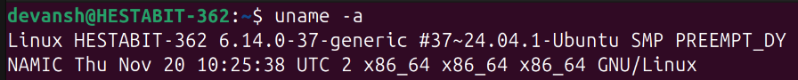
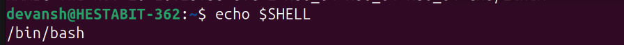
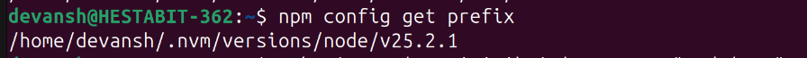
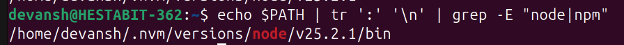

# **SYSTEM REPORT – DAY 1**

**Engineering Mindset Bootcamp**

**Name:** Devansh  
**Email:** devansh@hestabit.in

## **1\. Operating System Information**

**Command Used:**  
`uname -a`

**Description:**  
The system is running a Linux operating system with a 64-bit architecture. The kernel version confirms a modern Linux environment suitable for development and backend engineering tasks.

📸 **Screenshot:**

## **2\. Current Shell**

**Command Used:**  
`echo $SHELL`

**Description:**  
The system is using **Bash (Bourne Again Shell)** as the command-line shell. Bash is widely used in Linux environments and supports scripting, environment variables, and command automation.

📸 **Screenshot:**

## **3\. Node.js Binary Path**

**Command Used:**  
`which node`

**Description:**  
This output shows the exact location of the Node.js executable currently in use. Node.js is managed using **NVM (Node Version Manager)**, which allows switching between different Node versions efficiently.

📸 **Screenshot:**

## **4\. NPM Global Installation Path**

**Command Used:**  
`npm config get prefix`

**Description:**  
This directory is the global installation path for npm packages. All globally installed Node.js tools are stored inside this path and linked through the system’s PATH variable.

📸 **Screenshot:**

## **5\. PATH Entries Containing Node or NPM**

**Command Used:**  
`echo $PATH | tr ':' '\n' | grep -E "node|npm"`

**Description:**  
The PATH environment variable determines where the system looks for executable commands. This confirms that Node.js and npm binaries are correctly included in the PATH, ensuring they can be executed from any directory in the terminal.

📸 **Screenshot:**

## **Conclusion**

This exercise helped in understanding how to inspect a Linux system using terminal commands, identify runtime environments, and verify Node.js and npm configurations. These skills are essential for debugging, system setup, and real-world backend engineering work.

