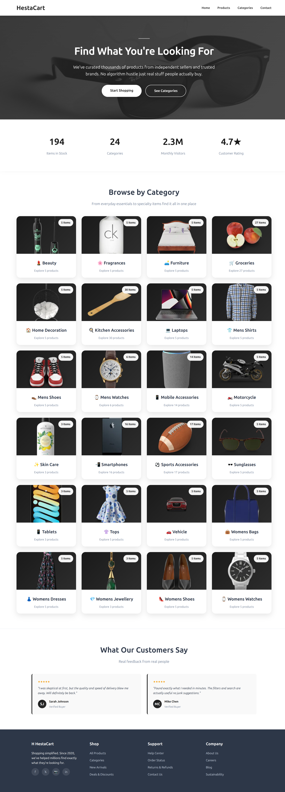
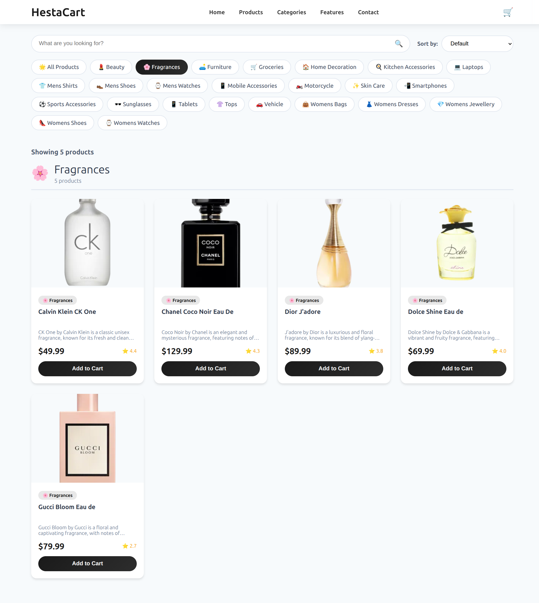
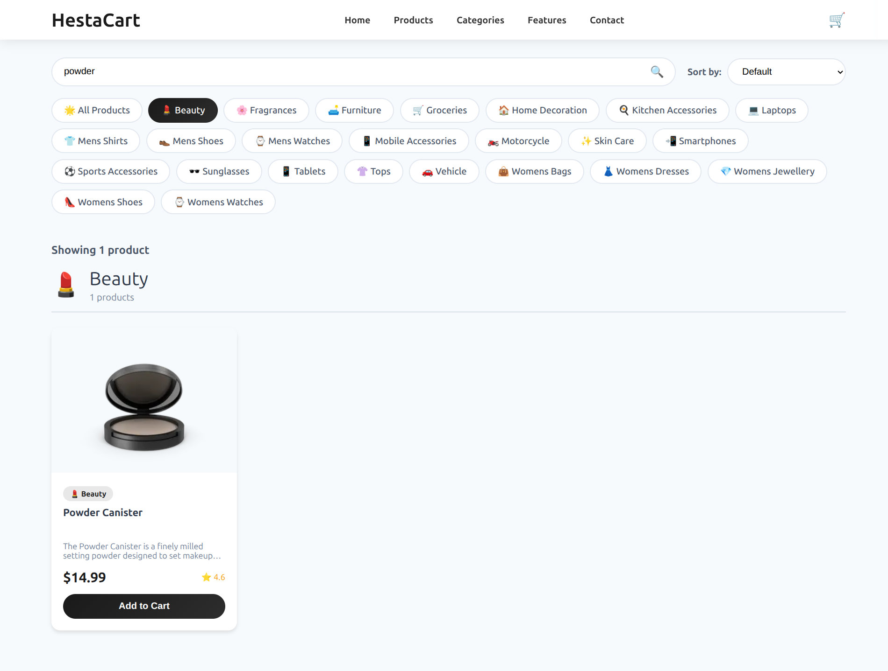
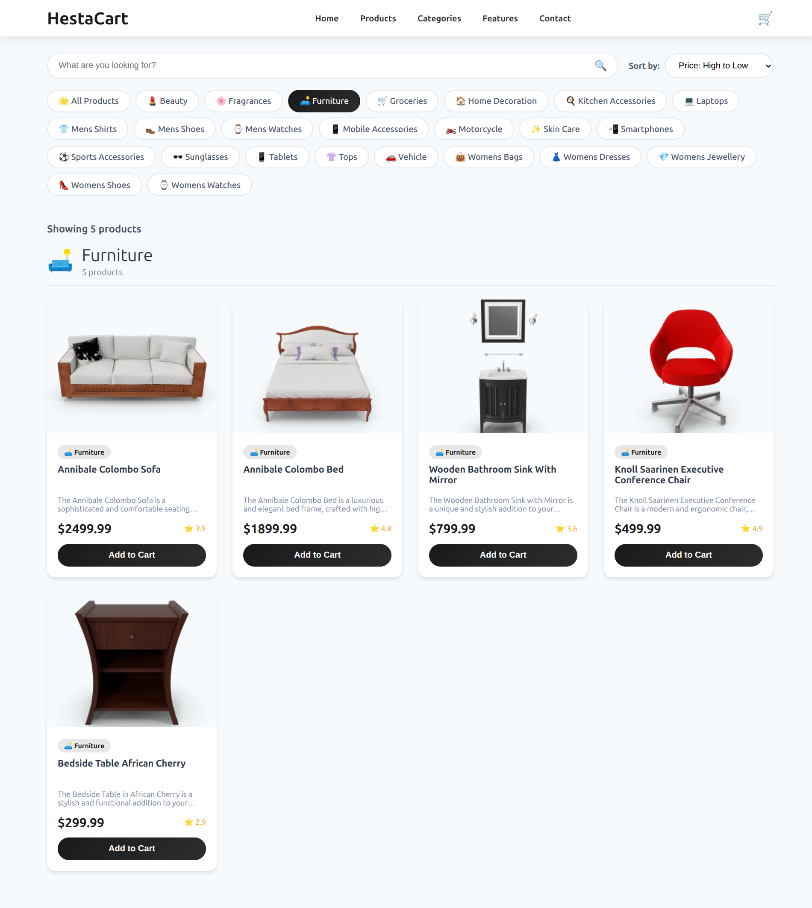
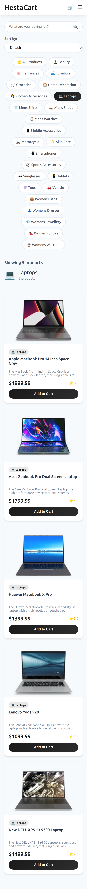

# Week 2 – Frontend Capstone (Day 5)

## Mini E-Commerce Product Listing Page

This project is part of **Week 2 – Frontend Fundamentals (Day 5)**.  
The goal of this task was to combine **HTML, CSS, and JavaScript** into a working UI using real API data.

I built a simple **e-commerce product listing page** where products are fetched from an API and displayed with search, sorting, and responsive design.


## Project Objective
- Use **Fetch API** to get product data
- Display products in card format
- Add **search** functionality
- Add **price sorting (High → Low)**
- Make the layout **mobile responsive**


## Technologies Used
- **HTML5** – page structure
- **CSS3** – styling and responsive layout
- **JavaScript (ES6)** – fetch API, DOM manipulation
- **DummyJSON API** – product data

API used:  
https://dummyjson.com/products


## Project Structure

```
Day5/
│
├── scripts/
│ ├── home.js
│ └── products.js
│
├── style/
│ ├── home.css
│ └── products.css
│
├── index.html
└── products.html
```

## ✨ Features Implemented
- Fetching products using **Fetch API**
- Displaying product cards with:
  - Image
  - Title
  - Price
- Search products using input field
- Sort products by price (High → Low)
- Responsive layout for mobile screens
- Clean separation of HTML, CSS, and JavaScript


## 🧠 What I Learned & Observed

While working on this project, I learned many new things and also understood how real frontend projects are structured.

- I learned how to use **Fetch API** to get data from an external API and display it on the webpage.
- I understood how **HTML, CSS, and JavaScript work together** to build a complete UI.
- I practiced using **JavaScript array methods** like `map`, `filter`, and `sort` to handle product data.
- I learned how to **manipulate the DOM** to dynamically show products on the page.
- I understood how **search functionality** works by filtering data based on user input.
- I learned how to **sort data** (like price high to low) using JavaScript logic.
- I practiced making the website **responsive** using CSS media queries.
- I learned how to organize files properly into folders like `scripts` and `style`.
- I observed that keeping code clean and separated makes it easier to understand and debug.
- I also learned how small UI changes can improve the user experience.


## 📸 Screenshots

### Homepage

### Products Page Desktop View

### Search Functionality

### Price Sorting`

### Mobile View


