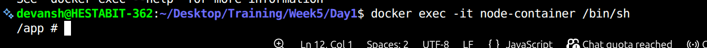
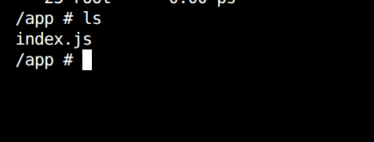
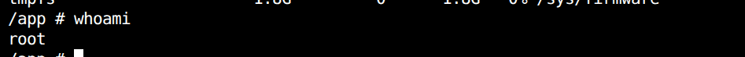
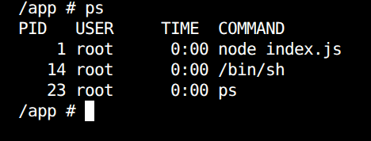
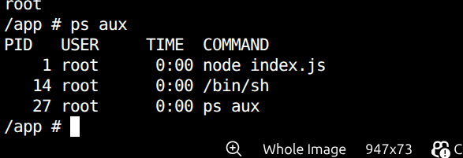
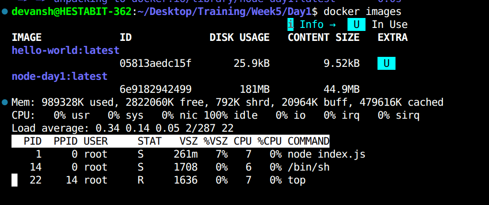
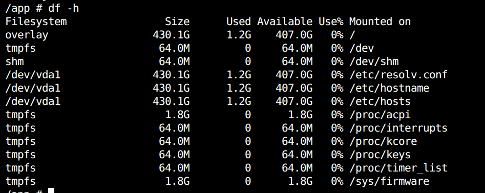
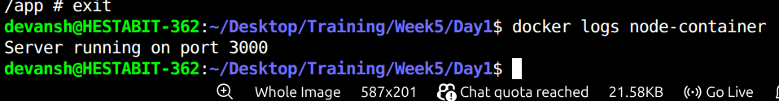

# Linux Inside a Docker Container  


## Overview

This document explains what was observed while exploring a running Docker container.  
The goal was to understand how **Linux behaves inside a container**, how processes work, how logs are handled, and how Docker interacts with the Linux kernel.

The container used in this exercise runs a Node.js application built using a custom `Dockerfile`.


## Container & Image Details

- **Base Image:** `node:18-alpine`
- **Application:** Simple Node.js HTTP server
- **Exposed Port:** `3000`
- **Main Process (PID 1):** `node index.js`


## Entering the Container

Command used:

```bash
docker exec -it node-container /bin/sh
```




## Filesystem Exploration (`ls`)

```bash
ls
```

Observed standard Linux directories like `/bin`, `/etc`, `/usr`, `/var`, and `/app`.




## User Information (`whoami`)

```bash
whoami
```

The container runs as the `root` user by default.



## Process Inspection

### Basic processes

```bash
ps
```


### Full process list

```bash
ps aux
```

- `node index.js` runs as **PID 1**
- Only container-specific processes are visible due to PID namespaces



## Resource Monitoring

```bash
top
```

Shows live CPU and memory usage using `/proc`.




## Disk Usage

```bash
df -h
```

- Uses layered filesystem (OverlayFS)
- Container data is ephemeral unless volumes are used



## Logs

```bash
docker logs node-container
```

- Logs are captured from stdout/stderr
- Best practice: applications log to stdout




---