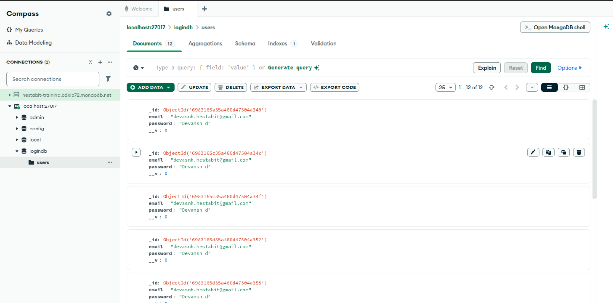
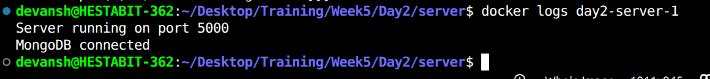
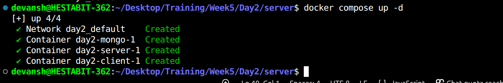

# Service Architecture

## Architecture Diagram (Logical)

```
Client (React)
   ↓ HTTP (REST API)
Server (Node.js / Express)
   ↓ MongoDB Driver (Mongoose)
MongoDB (Database)
```

## Services Description

### Client Service (React)

- Technology: React (react-scripts)
- Port: 3000
- Purpose:
  - Provides login and registration UI
  - Sends HTTP POST requests to backend APIs


### Server Service (Node.js / Express)

- Technology: Node.js, Express, Mongoose
- Port: 5000
- Purpose:
  - Handles user authentication logic
  - Connects to MongoDB using container networking

Endpoints:
- GET /health
- POST /register
- POST /login


### Database Service (MongoDB)

- Image: mongo:6
- Data directory: /data/db
- Uses Docker named volume for persistence


## Docker Networking

- Docker Compose creates a default bridge network
- Containers communicate using service names
- Example: mongodb://mongo:27017/logindb


## Volumes and Persistence

A named volume is used to persist MongoDB data:

volumes:
  mongo_data:

This ensures data is preserved across container restarts.




## Logging

Logs can be accessed using Docker Compose:

docker compose logs
docker compose logs server
docker compose logs -f server



## Startup and Shutdown

Start services:
docker compose up -d

Stop services:
docker compose down




## Verification Checklist

- React UI available at http://localhost:3000
- Backend API running at http://localhost:5000
- MongoDB connected successfully
- Data persists after restarts
