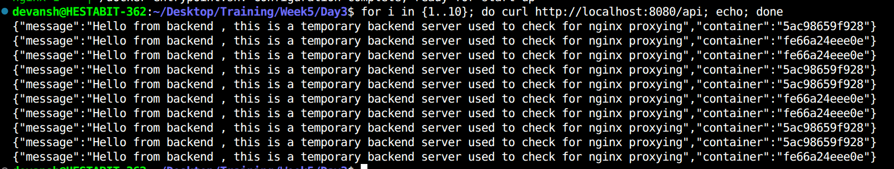

# NGINX Reverse Proxy with Load Balancing (Docker)

## Overview
This project demonstrates how to use  NGINX as a reverse proxy and load balancer
in front of multiple backend services running inside Docker containers.

NGINX routes incoming requests to backend containers and distributes traffic
using round-robin load balancing

## Components

### Backend Service
- Node.js + Express
- Runs on port 3000
- Returns container hostname to verify load balancing

### NGINX Reverse Proxy
- Single entry point
- Routes /api requests
- Uses round-robin load balancing


## Load Balancing

- Strategy: Round-robin
- Requests distributed evenly
- Load balancing occurs per connection


## Testing

Command used:
```bash
for i in {1..10}; do curl http://localhost:8080/api; echo; done
```

Output 

