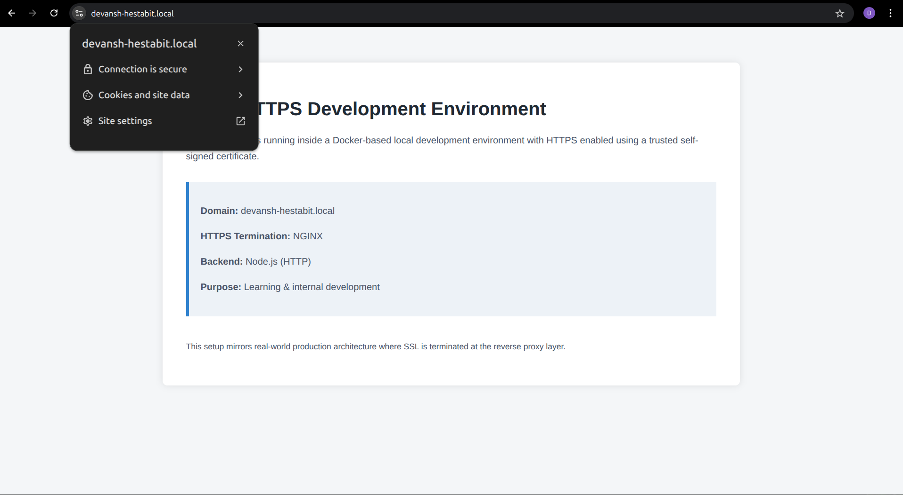

# SSL / HTTPS Setup (Local Development)

## Introduction

This document describes the setup of HTTPS in a local development environment using
self-signed certificates generated via mkcert with SSL termination handled by NGINX.

## Domain Configuration

Local Domain Used:
```
devansh-hestabit.local
```
## SSL Tooling

Certificate Tool: mkcert  

mkcert is used to:
- Create a local Certificate Authority (CA)
- Add the CA to the system and browser trust stores
- Generate trusted SSL certificates for local domains

## Certificates Generated

The following files were generated using mkcert:

- `devansh-hestabit.local.pem` — SSL certificate
- `devansh-hestabit.local-key.pem` — Private key

## Architecture

```
Browser
  ↓ HTTPS (443)
NGINX (SSL Termination)
  ↓ HTTP (3000)
Node.js Application
```
- The browser communicates securely with NGINX over HTTPS
- NGINX terminates SSL and forwards requests to the backend over HTTP
- The backend application does not handle SSL directly

## HTTPS Termination

SSL/TLS termination is handled at the NGINX layer.  
This means:
- Certificates are managed centrally
- Backend services remain protocol-agnostic

## HTTP to HTTPS Redirection

All incoming HTTP traffic on port `80` is permanently redirected to HTTPS using a `301` redirect.
This ensures:
- Encrypted communication is always enforced
- Accidental insecure access is prevented
- Browser and search engine behavior aligns with production standards

## Containerization

The environment is fully containerized using Docker and Docker Compose:
- Backend application runs in its own container
- NGINX runs as a reverse proxy container
- SSL certificates are mounted into the NGINX container

## Screenshot

