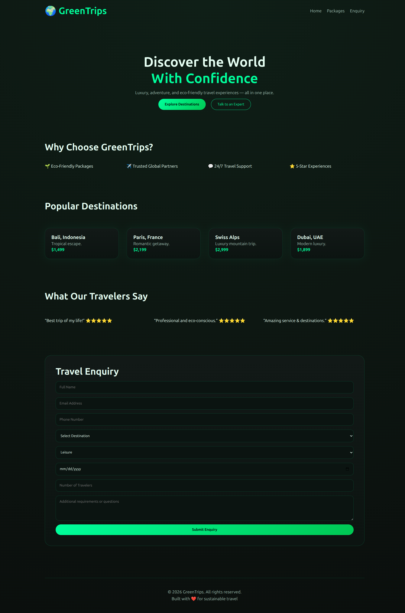
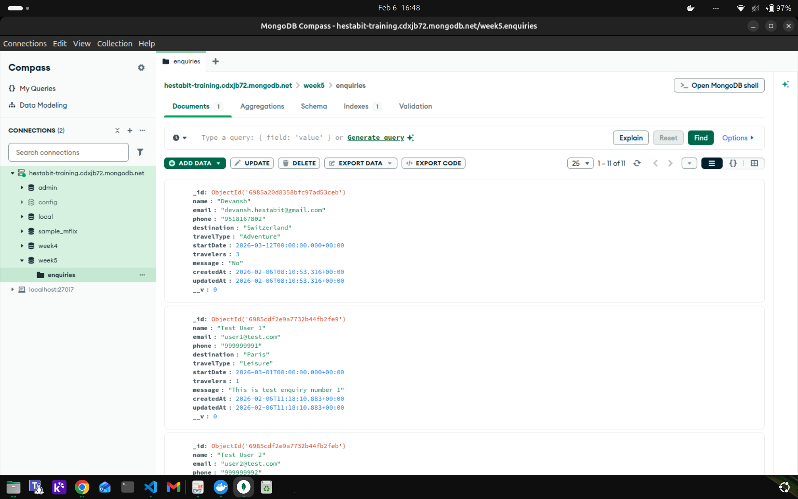
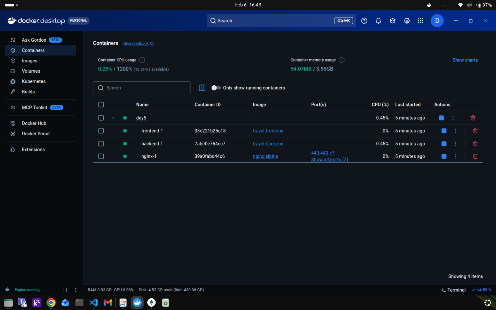
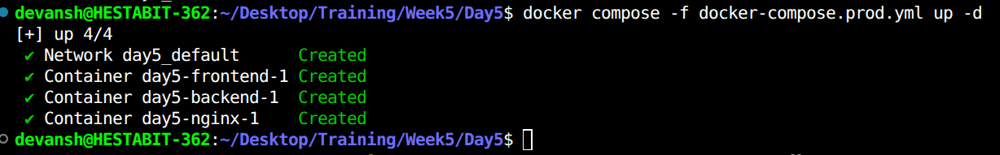
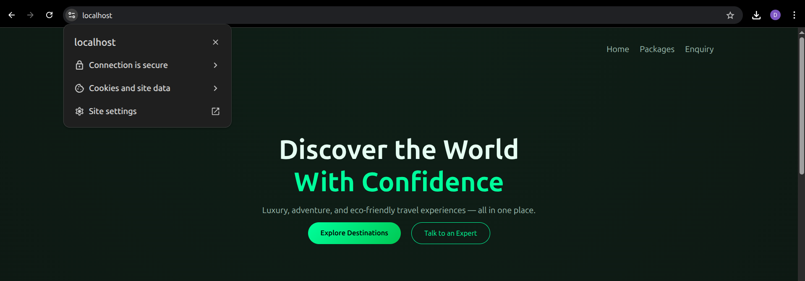

# Production Deployment Guide


##  Overview

Stack
- Frontend: React (Vite)
- Backend: Node.js + Express
- Database: MongoDB Atlas
- Reverse Proxy: Nginx
- Containers: Docker & Docker Compose
- SSL: HTTPS using **mkcert** (local trusted certificates)

**Architecture**
```
Browser (HTTPS)
   ↓
Nginx Reverse Proxy
   ↓
Frontend (React)
   ↓
Backend (Express API)
   ↓
MongoDB Atlas
```


## Application Screenshots

### Frontend UI


### Backend Mongo Compass


### Docker Containers Running


### Docker Compose Stack



### Backend (`server/.env`)
```env
MONGO_URI=your_mongodb_atlas_uri
PORT=5000
```

### Frontend (`client/.env`)
```env
VITE_API_URL=/api
```


##  Docker Compose (Production)

The production stack is defined in `docker-compose.prod.yml` and includes:

- backend – Express API with MongoDB connection
- frontend – React production build served by Nginx
- nginx – Reverse proxy + HTTPS termination


##  Health Checks

Backend exposes a health endpoint:
```http
GET /health
```

Check manually:
```bash
curl -k https://localhost/api/health
```

Expected response:
```json
{ "status": "OK" }
```


## HTTPS (mkcert)

Local HTTPS is enabled using mkcert.

### Steps Used
1. Install mkcert
2. Run `mkcert -install`
3. Generate certificates:
   ```bash
   mkcert localhost 127.0.0.1
   ```
4. Mount certs into Nginx container
5. Configure Nginx to redirect HTTP → HTTPS

### Access Application
```
https://localhost
```

Browser shows a trusted 🔒 lock.
   

## Logs & Rotation

All services use Docker's `json-file` logging driver:


##  Restart Policy

All services use:
```yaml
restart: always
```

Ensures automatic recovery on crash or system reboot.

##  Testing the Application

### Insert Test Data
```bash
curl -k -X POST https://localhost/api/enquiries \
  -H "Content-Type: application/json" \
  -d '{"name":"Test User","email":"test@test.com","destination":"Paris"}'
```

### Verify in MongoDB Compass
```
Database: travel_app
Collection: enquiries
```
