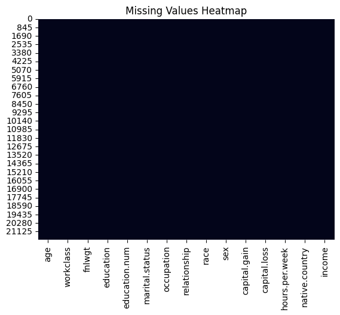
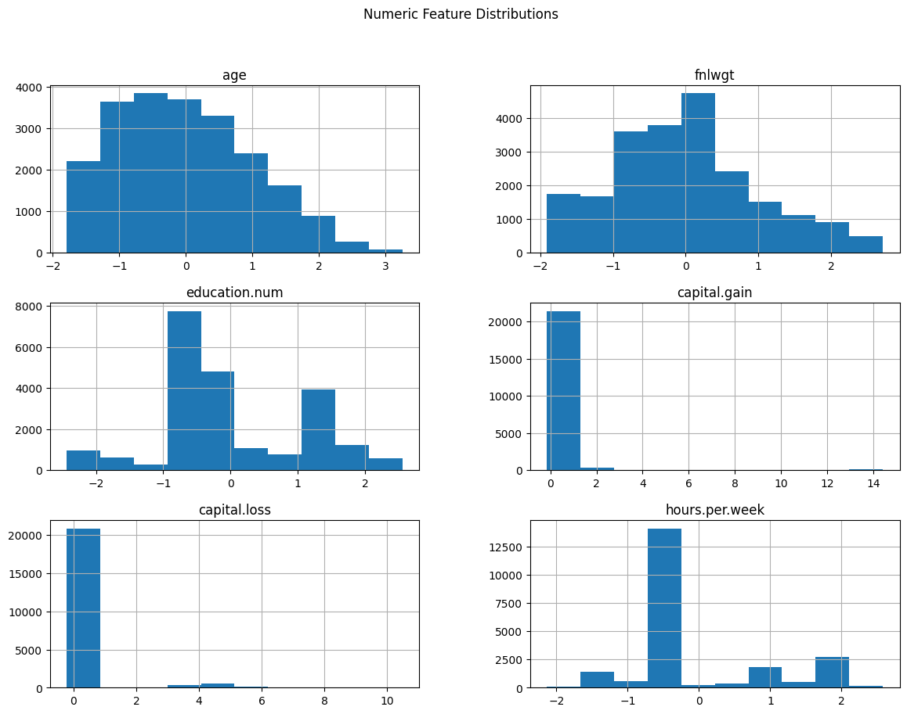
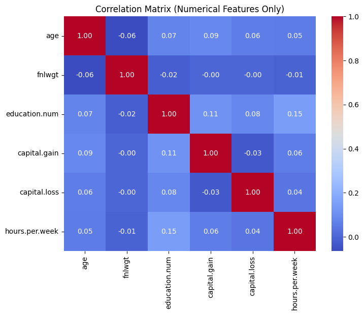
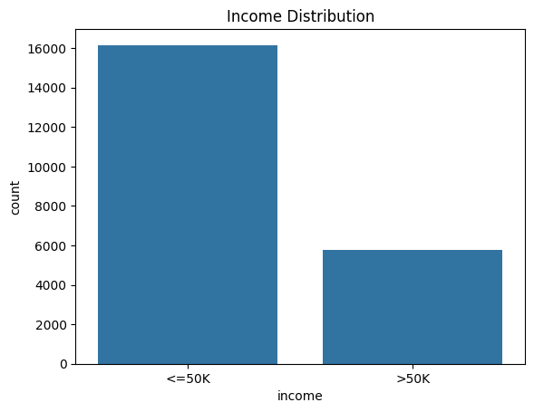

# DATA REPORT — Adult Census Income Dataset

## 1. Objective
The objective of this data pipeline and EDA process is to prepare a clean, reliable, and well-understood dataset for a machine learning classification task.  
The target is to predict whether an individual's income exceeds 50K per year.

## 2. Dataset Overview
- Dataset Name: Adult Census Income
- Task Type: Binary Classification
- Target Variable: `income`
  - `<=50K`
  - `>50K`
- Total Columns: 15
- Data Source Location:  
  `src/data/raw/dataset.csv`

## 3. Project Data Architecture

### Raw Data
- Location: `src/data/raw/`
- Characteristics:
  - Original dataset
  - Never modified directly
  - Serves as the single source of truth

### Processed Data
- Location: `src/data/processed/`
- Output File:
  - `final.csv`
- Purpose:
  - Cleaned and ML-ready dataset
  - Used for EDA, training, and evaluation

## 4. Data Cleaning & Preprocessing Steps

### 4.1 Missing Value Handling
- The dataset uses `"?"` to represent missing values.
- `"?"` values were converted to `NaN`.
- Numerical columns:
  - Imputed using median (robust to outliers).
- Categorical columns:
  - Imputed using mode (most frequent category).

### 4.2 Duplicate Handling
- Duplicate rows were identified and removed to prevent bias and data leakage.

### 4.3 Outlier Handling
- Outliers were detected using the Interquartile Range (IQR) method.
- Applied only to appropriate numerical features.
- Columns with zero-inflated distributions (`capital.gain`, `capital.loss`) were excluded from aggressive outlier removal to preserve meaningful information.

### 4.4 Feature Scaling
- Numerical features were scaled using StandardScaler:
  - Mean = 0
  - Standard Deviation = 1
- Scaling was applied only to feature columns.
- The target variable (`income`) was explicitly excluded from scaling.

## 5. Exploratory Data Analysis (EDA)

EDA was performed using the processed dataset to validate the effectiveness of the cleaning pipeline.

### 5.1 Missing Values Analysis
- Missing values heatmap showed no remaining missing values.
- Confirms successful imputation.

### 5.2 Feature Distributions
- Histograms were generated for all numerical features.
- Observations:
  - Some features show skewed distributions.
  - Zero-inflated behavior observed in capital gain/loss features.
  

### 5.3 Correlation Analysis
- Correlation matrix generated for numerical features only.
- Used to identify:
  - Linear relationships
  - Multicollinearity risks
  

### 5.4 Target Distribution
- Target variable (`income`) distribution analyzed.
- Observed class imbalance:
  - Majority class: `<=50K`
  - Minority class: `>50K`
  

## 6. Key Observations & Considerations
- Dataset required explicit handling of non-standard missing values (`"?"`).
- Capital gain and loss features require special treatment due to zero inflation.
- Target variable is categorical and must be encoded in later stages.
- Class imbalance must be addressed during model training.
