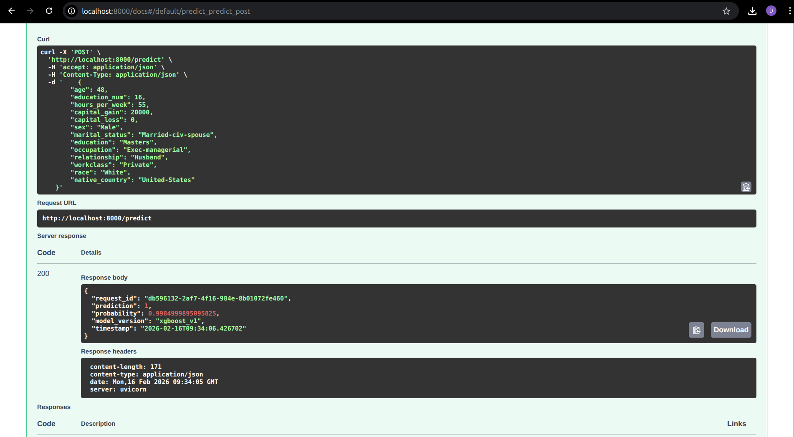
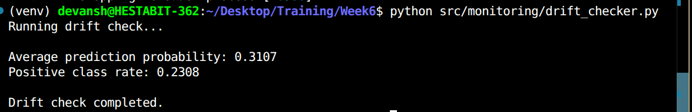
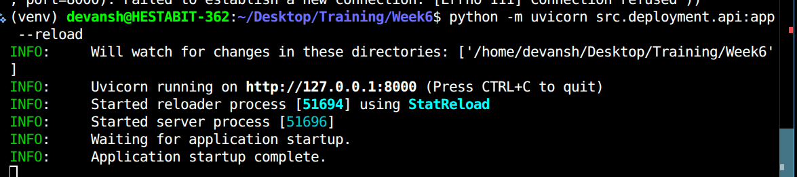
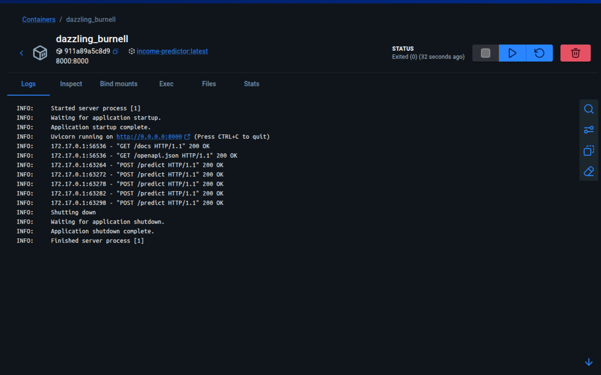

# DEPLOYMENT-NOTES.md

## Income Prediction ML System
This document summarizes the final deployment process, verified setup, and production-ready checklist for the Income Prediction ML application.


## 1. Environment Consistency (CRITICAL)

### Final Verified Versions
- Python: 3.12.3 (Docker)
- Python (Local training): 3.12.3
- FastAPI: 0.129.0
- Uvicorn: 0.40.0
- scikit-learn: 1.8.0
- pandas: 3.0.0
- numpy: 2.3.5
- xgboost: 3.2.0
- joblib: 1.5.3


## 2. Final Docker Configuration

### Dockerfile
```dockerfile
FROM python:3.12.3-slim

WORKDIR /app

COPY requirements.txt .
RUN pip install --no-cache-dir -r requirements.txt

COPY . .

EXPOSE 8000

CMD ["uvicorn", "src.deployment.api:app", "--host", "0.0.0.0", "--port", "8000"]
```


## 3. Required Artifacts

- src/models/best_model.pkl
- src/models/preprocessor.pkl
- src/models/selector.pkl
- src/features/feature_list.json
- src/data/processed/final.csv

## 4. API Contract

### Endpoint
POST /predict

Input 
- age (int)
- education_num (int)
- hours_per_week (int)
- capital_gain (int)
- capital_loss (int)
- sex (str)
- marital_status (str)
- education (str)
- occupation (str)
- relationship (str)
- workclass (str)
- race (str)
- native_country (str)


Output
- request_id
- prediction
- probability
- model_version
- timestamp



## 5. Logging & Monitoring

- Predictions logged to `src/prediction_logs.csv`
- Drift metrics computed via `src/monitoring/drift_checker.py`


## 6. Testing

### Local
python -m uvicorn src.deployment.api:app --reload


### Python Evironment
```
python src/utils/run_tests.py
```
### Docker
docker build -t income-predictor -f src/deployment/Dockerfile .
docker run -p 8000:8000 income-predictor


## 7. Known Pitfalls (Resolved)

- sklearn/pandas version mismatch
- docker context issues
- model artifact incompatibility
- Training-serving skew avoided by loading saved preprocessing artifacts

