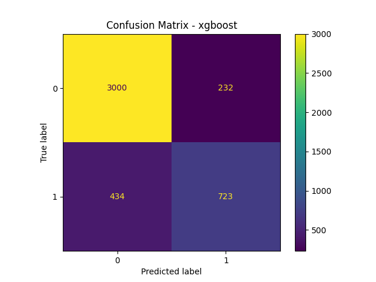

# Model Comparison Report

# Dataset Overview

-   Cleaned and preprocessed dataset (Day 1)
-   Engineered 10+ new features (Day 2)
-   Applied feature selection (Top 20 features selected using Mutual
    Information)
-   Final feature space: 20 selected features
-   Train/Test split: 80/20 (Stratified)

# Models Evaluated

  Model                 
  - Logistic Regression
  - Random Forest 
  - XGBoost 
  - MLP (Neural Network)   Feedforward neural network
# Evaluation Strategy

-   5-Fold Stratified Cross-Validation
-   Metrics computed:
    -   Accuracy
    -   Precision
    -   Recall
    -   F1 Score
    -   ROC-AUC
-   Final evaluation performed on held-out test set
-   Best model selected based on **F1 Score**

# Cross-Validation Results

  Model                 F1 Score (CV Mean)
  Logistic Regression   0.6555
  Random Forest         0.6440
  XGBoost               0.6836
  MLP                   0.6412

# Best Model Selected

**XGBoost**

Reason: - Highest F1 Score during cross-validation - Strong non-linear
modeling capability - Performs well on structured/tabular datasets -
Robust to feature interactions

# Test Set Performance (Best Model)

Metrics computed on unseen test data:

-   Accuracy: See evaluation/metrics.json
-   Precision: See evaluation/metrics.json
-   Recall: See evaluation/metrics.json
-   F1 Score: See evaluation/metrics.json
-   ROC-AUC: See evaluation/metrics.json

# Confusion Matrix

