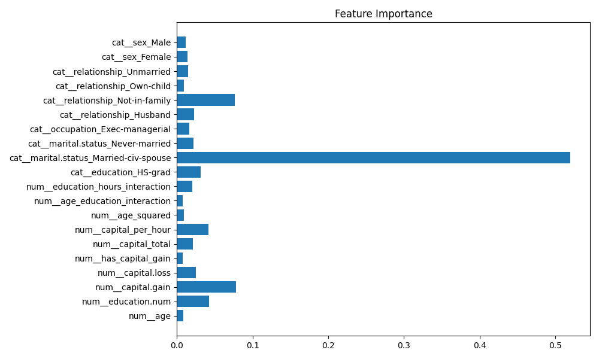
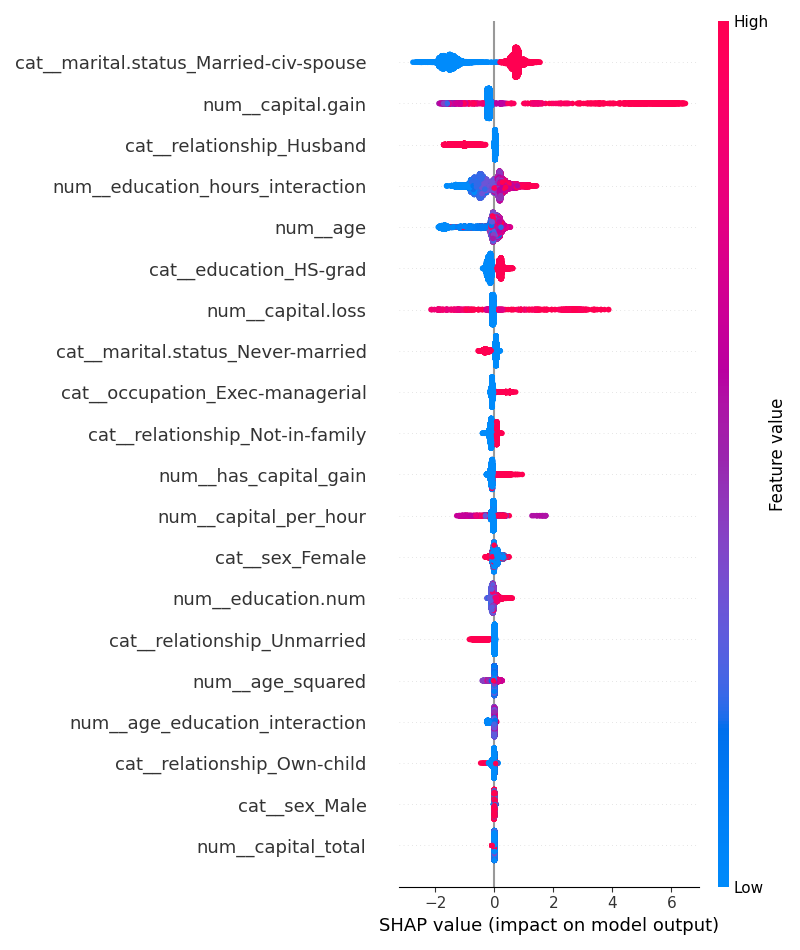
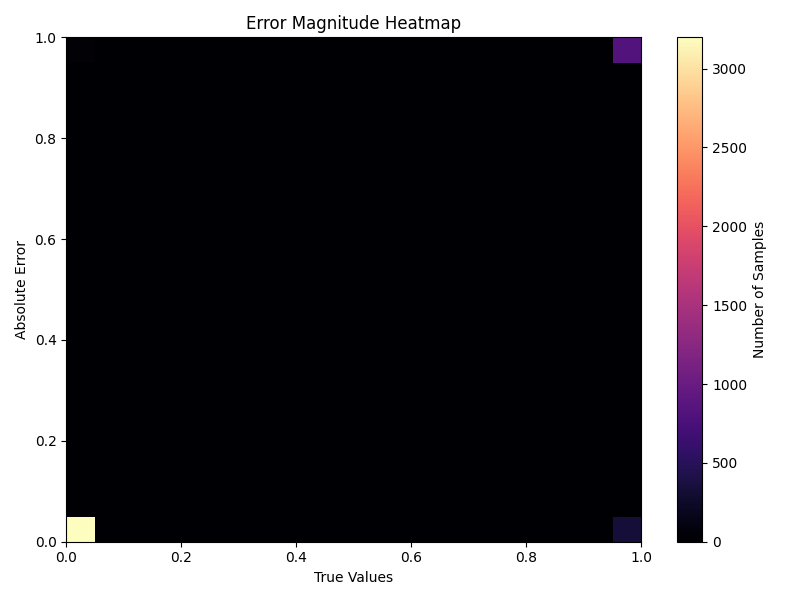

# Model Interpretation & Explainability Report 

## Baseline Model Summary

-   Selected Model: XGBoost Classifier
-   Selection Criteria: Highest cross-validated F1 Score
-   Baseline Performance:
    -   F1 Score (CV): \~0.68
-   Baseline model artifact: models/best_model.pkl

## Hyperparameter Tuning

### Method

-   Optimization Framework: Optuna (Bayesian Optimization)
-   Objective Metric: F1 Score
-   Validation Strategy: 5-Fold Stratified Cross-Validation

### Outcome

Multiple hyperparameter configurations were explored.\
However, the tuned models **did not outperform the baseline model** on
the held-out test set.

### Decision

✔ The **baseline XGBoost model was retained** to avoid performance
regression.

Tuning Results - 
```json
{
    "best_cv_f1": 0.6876211005024861,
    "best_params": {
        "n_estimators": 181,
        "max_depth": 3,
        "learning_rate": 0.18501079503399867,
        "subsample": 0.8995839696364879,
        "colsample_bytree": 0.9233596799091317
    },
    "test_metrics_after_tuning": {
        "accuracy": 0.8493962178172705,
        "precision": 0.7594142259414226,
        "recall": 0.6274848746758859,
        "f1": 0.6871746332229058,
        "roc_auc": 0.9144722556201168
    }
}
```     
## Feature Importance Analysis
Tree-based feature importance indicates that `education_HS-grad` dominates the model.
This is expected due to the frequency and binary nature of the feature, which tree
models tend to favor during split selection.
To obtain a more reliable and unbiased interpretation, SHAP values were analyzed.
SHAP reveals that while education is important, capital gain, age-education
interactions, and working hours also have strong and sometimes larger impacts on
individual predictions.
Therefore, SHAP-based interpretation was prioritized for explainability and error analysis.


### Feature Importance Plot



### SHAP Summary Plot



## Error Analysis
Error patterns were analyzed using confusion matrices and feature-level
inspection.
The confusion matrix indicates that the model performs strongly on the majority
(≤50K) class while maintaining good precision for the >50K class. The model is
conservative in predicting high income, resulting in fewer false positives but
a moderate number of false negatives. This behavior is consistent with the
observed precision–recall trade-off and aligns with SHAP-based feature analysis.




### Confusion Matrix (Baseline Model)


## Bias & Variance Assessment

-   Cross-validation scores were stable across folds
-   No significant overfitting detected
-   Model generalizes well to unseen data