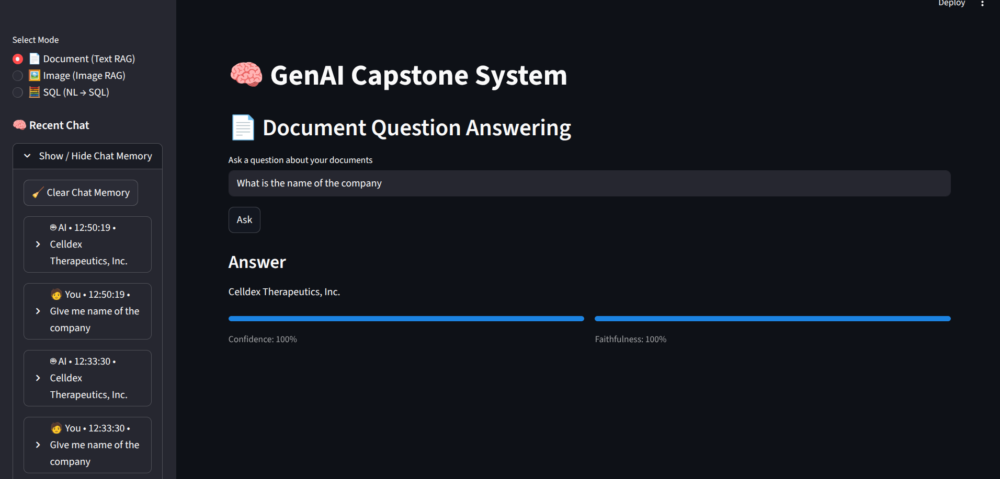
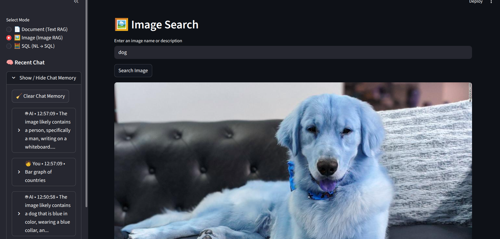
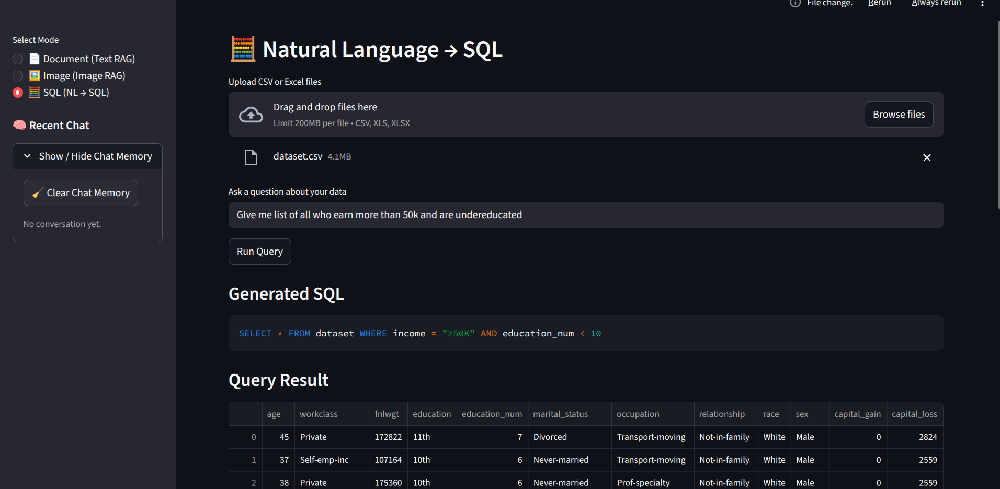

# DEPLOYMENT NOTES

## Project Summary
This project implements an advanced Retrieval-Augmented Generation (RAG) system with memory, evaluation, refinement, and logging. The system supports text-based document QA, image-based retrieval, and natural language to SQL querying through a Streamlit interface.

## System Architecture
```
User → Streamlit UI
     → Mode Selection
     → Backend Endpoint (/ask, ask-image, /ask-sql)
     → Retrieval / Pipeline
     → LLM Generation
     → Evaluation + Refinement
     → Logging
     → Response to UI

```

## Supported Endpoints
- `/ask` — Document-based Question Answering (Text RAG)

- `/ask-image` — Image Retrieval and Description (Image RAG)

- `/ask-sql` — Natural Language to SQL over uploaded datasets



## Conversational Memory
- File-based memory using JSON (`memory.json`)
- Stores the last 5 user–assistant message pairs
- Memory is isolated per mode (text, image, SQL)


## Evaluation & Refinement
- Confidence score to estimate answer relevance
- Faithfulness score to measure grounding in retrieved context
- Automatic refinement loop triggers when evaluation scores are weak


## Logging
- All interactions across all modes are logged in `CHAT-LOGS.json`
- Each log entry contains:
  - Timestamp
  - Session ID
  - Mode
  - User input
  - Model output
  - Confidence score (if applicable)
  - Faithfulness score (if applicable)
  - Refinement indicator


## User Interface
- Built with Streamlit
- Mode-based interaction
- Collapsible chat history
- Confidence and faithfulness visual indicators
