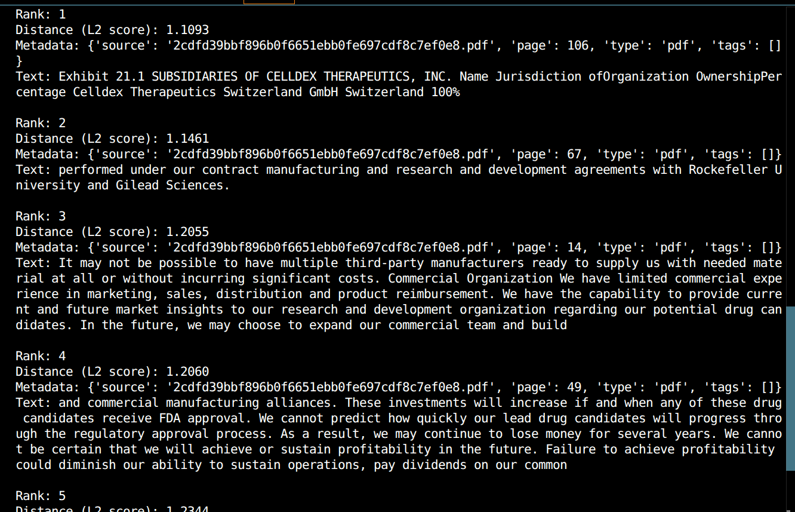

# RAG Architecture – Day 1  

## 1. High-Level Architecture

User Query  
→ Query Embedding  
→ Vector Database (FAISS)  
→ Top-K Relevant Chunks  
→ (Generator added in later stages)

## 2. Document Ingestion

Supported formats:
- PDF
- TXT
- DOCX
- CSV

Metadata attached:
- source
- page / row
- type
- tags

## 3. Chunking Strategy

- Chunk size: 700 characters
- Overlap: 100 tokens

Rationale:
- Preserves semantic continuity
- Fits LLM context windows
- Improves retrieval quality

## 4. Embedding Pipeline

- Model: all-MiniLM-L6-v2
- Local, CPU-based
- One embedding per chunk

## 5. Vector Database

- FAISS Flat (Exact Search)
- Index type: IndexFlatL2

Chosen for correctness and debuggability in Day 1.

## 6. Retriever Module

Steps:
1. Embed query
2. FAISS similarity search
3. Return top-k chunks with metadata

## 7. Scope Summary

Implemented:
- Ingestion
- Chunking
- Metadata tagging
- Embeddings
- Vector indexing
- Retriever

Deferred:
- LLM generator
- Hybrid retrieval
- Reranking
- Evaluation
