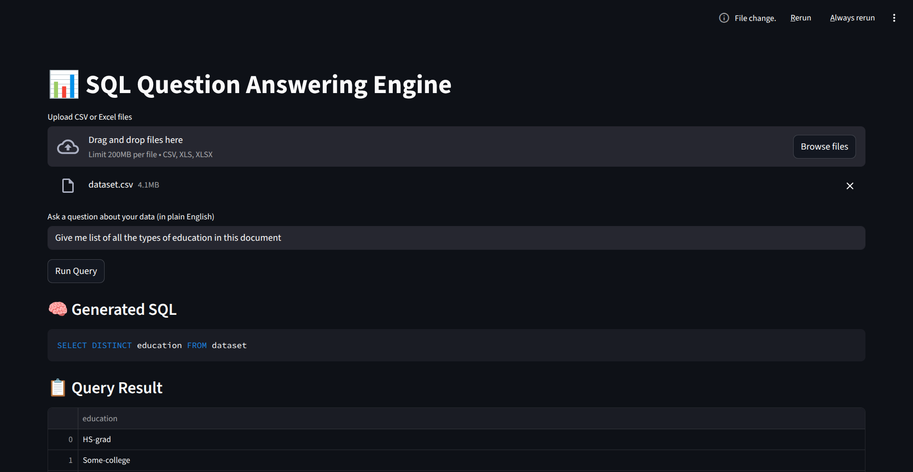
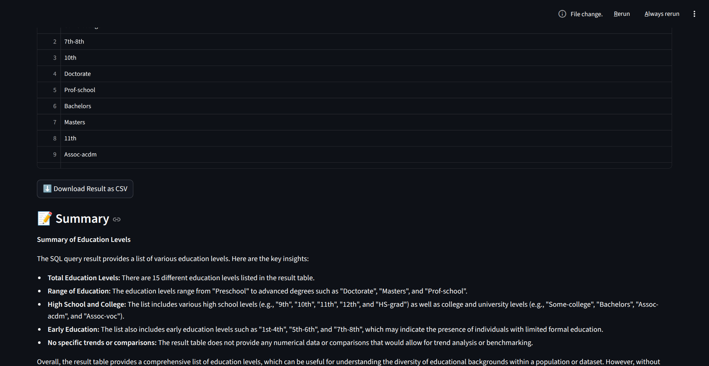

# SQL-Generator

## 1. Objective

The goal of Day 4 is to build a NL to SQL generator that allows users to ask questions in natural language and receive accurate answers by querying structured data.

The system converts *ext → SQL → Answer while ensuring:
- Schema awareness
- SQL safety
- Correct execution
- Clear result summarization

## 2. System Architecture

User Question (Text)  
↓  
Schema Extraction (SQLite)  
↓  
LLM-based SQL Generation  
↓  
SQL Validation (Read-only)  
↓  
Safe SQL Execution  
↓  
Result Table  
↓  
Natural Language Summary  

### Schema Extractor

Purpose:
- Dynamically extracts tables and columns from SQLite
- Prevents hallucinated SQL queries

Functionality:
- Reads database metadata
- Formats schema into LLM-readable text

### SQL-Generator

Purpose:
- Converts natural language questions into SQL

Key Characteristics:
- Uses Groq LLM (LLaMA-3.1)
- Generates only SELECT queries

### Pipeline

Pipeline Steps:
1. Load user data into SQLite
2. Extract schema
3. Generate SQL via LLM
4. Validate SQL for safety
5. Execute SQL
6. Summarize results

Security Rules:
- Only SELECT queries allowed
- Blocks DROP, DELETE, INSERT, UPDATE, ALTER, TRUNCATE

## 3. Example Walkthrough

## 4. Validation & Safety

- Schema-aware prompting prevents invalid columns
- Read-only SQL enforcement
- No user-provided SQL execution
- No database mutation allowed
