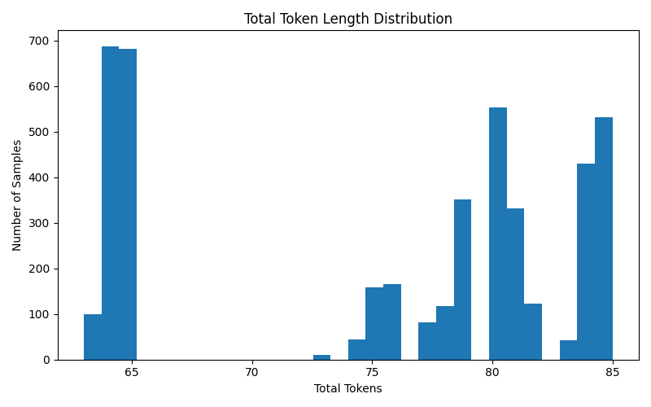

# DATASET ANALYSIS 

## 1. Domain
Human Resources (HR)

The dataset is focused exclusively on HR-related tasks such as employee profiling, attrition analysis, and structured extraction of HR metrics.


## 2. Dataset Source
- IBM HR Analytics Employee Attrition Dataset (Kaggle)
- Original format: CSV
- Converted into instruction-tuning format

## 3. Instruction Format

```json
{
  "instruction": "...",
  "input": "...",
  "output": "..."
}
```

## 4. Task Types Included

### 4.1 Question Answering (QA)
- Employee profile understanding
- HR concept interpretation

### 4.2 Reasoning
- Attrition risk analysis
- Multi-factor HR decision making

### 4.3 Extraction
- Structured HR metric extraction
- Output in strict JSON format

## 5. Dataset Construction

1. CSV ingestion and cleaning
2. Duplicate and null removal
3. Normalization of categorical fields
4. Instruction generation (3 samples per employee)
5. Token filtering
6. Shuffle and split


## 6. Dataset Size

- Raw generated samples: ~4,000+
- Clean samples: ~3,800+
- Training set: ~90%
- Validation set: ~10%


## 7. Token Analysis

- Tokenizer: GPT-2
- Avg total tokens/sample: ~75
- Min tokens: ~30
- Max tokens: ~120


## 9. Distribution Graphs


