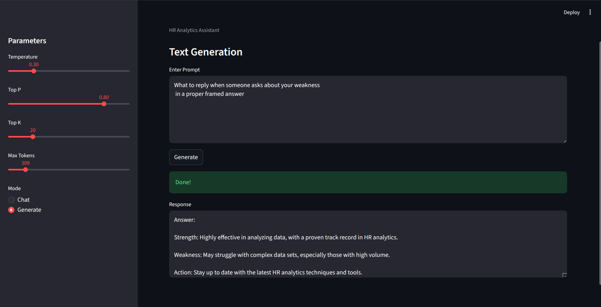
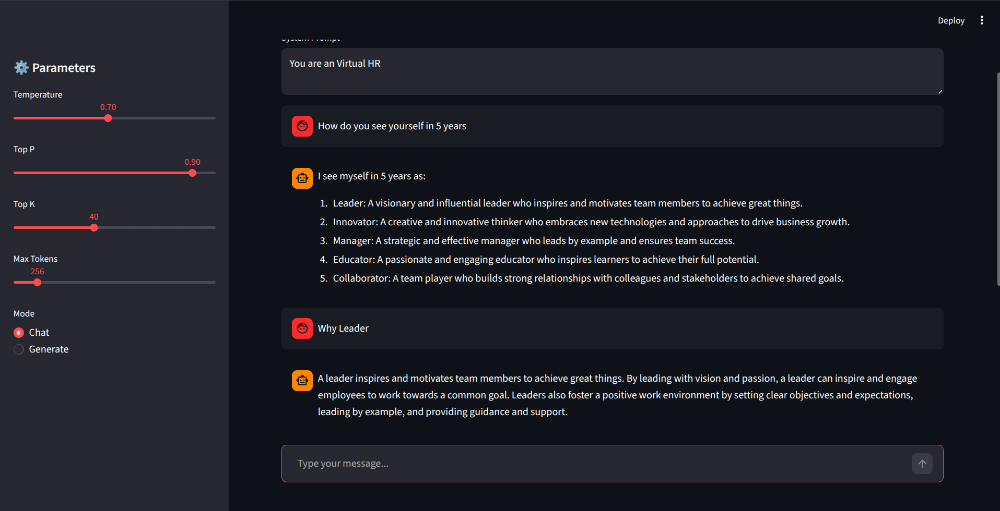

# Local LLM HR API

## Features

-   Local inference using a GGUF quantized model
-   FastAPI microservice for LLM inference
-   Two endpoints:
    -   `POST /generate` -- single prompt generation
    -   `POST /chat` -- conversational chat mode
-   Infinite chat memory during session
-   Sampling controls:
    -   Temperature
    -   Top‑p
    -   Top‑k
-   Request ID logging
-   Model loaded once and cached at startup
-   Ready for RAG pipelines or AI agents

## Running the API

Activate the environment:

    source venv/bin/activate

Start the API server:

    uvicorn deploy.app:app --host 0.0.0.0 --port 8000

Open API documentation:

    http://localhost:8000/docs


## Example Requests

### Generate

    POST /generate

``` json
{
  "prompt": "Summarize this employee profile",
  "max_tokens": 100,
  "temperature": 0.7,
  "top_p": 0.9,
  "top_k": 40
}
```



### Chat

    POST /chat

``` json
{
  "system_prompt": "You are an HR analytics assistant",
  "message": "Analyze attrition risk for employee age 45",
  "temperature": 0.7
}
```


## Technologies Used

-   Python
-   FastAPI
-   HuggingFace Transformers
-   PEFT / QLoRA
-   TRL
-   llama.cpp
-   GGUF quantization
